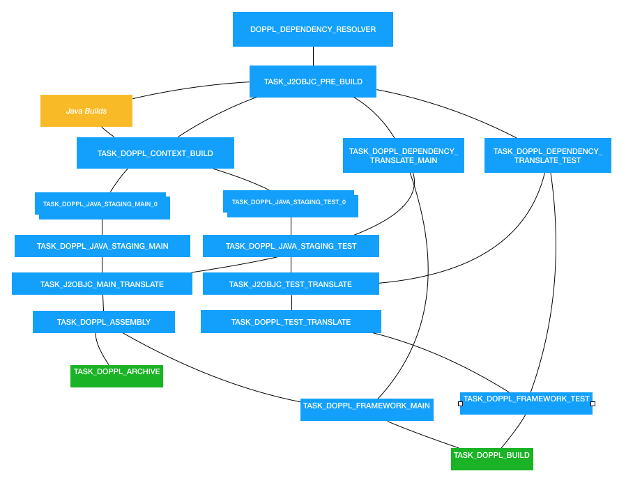

# Doppl Gradle Plugin

This the Doppl framework Gradle plugin. Doppl is a build and dependency system intended to facilitate Android and iOS
code sharing using J2ojbc.

[What is Doppl?](http://doppl.co/overview.html)

[Quick Start](http://doppl.co/docs/quicktutorial.html)

[Doppl Gradle Plugin](http://doppl.co/docs/gradleplugin.html)

This plugin started as a fork of the [J2objc-gradle](https://github.com/j2objc-contrib/j2objc-gradle) project. It has morphed
significantly, but the general DNA in the translate pipeline is still there.

## Tasks

This is the task dependency tree. The referenced constants can be found in DopplPlugin.groovy. For users, the important 
ones to note are:

* TASK_DOPPL_BUILD - 'dopplBuild' This will stage and translate dependencies and source for both main and test paths,
and create the cocoapods podspec files to be used in Xcode. It's probably the only task you'll ever reference directly.

* TASK_DOPPL_ARCHIVE - 'dopplArchive' This creates the dependency structure for distributing libraries. You'll only need
this if you're creating a library.

* TASK_J2OBJC_PRE_BUILD - 'j2objcPreBuild' If you need to run something before EVERYTHING in doppl runs, make this task depend on your task.

* TASK_DOPPL_CONTEXT_BUILD - 'dopplContextBuild' Similar to above, but run after all the project's java operations run, 
including annotation processing.



## Config

Options that can be set in dopplConfig. Except where noted, the example value in the default, and
can be left empty in your config (if you're happy with the default).

```groovy
dopplConfig {

    //Adds metadata to generated code that will let you debug in Java instead of Objective-C
    javaDebug false
    
    //Adds metadata to generated code that will let you debug in Java instead of Objective-C
    //This applies to dependency code
    dependenciesJavaDebug false
    
    //Prefix applied to classes with matching package. Shortens Objective-C name.
    //All packages must be explicitly added. No wildcards.
    // *There are no default prefixes defined*
    translatedPathPrefix 'com.example.foo', 'FOO' 
    translatedPathPrefix 'com.example.bar', 'BAR'
    
    //By default, all Java code in your module is translated. However, in some cases this won't make
    //sense. Especially if in an Android module. Use a pattern to match which files you want 
    //to translate
    translatePattern {
        include '**/shared/**'
        include '**/BuildConfig.*'
    }
    
    //Applies to 'dopplTest', which creates a list of tests to run based on path
    //By default, the pattern is 'include "**/*Test.java"', but can be customized.
    testIdentifier {
        include "**/*Test.java"
        exclude "**/OneTest.java" //A file matches that we don't want
        exclude "**/Abstract**.java"
    }
    
    //The cocoapod framework definitions have some specific config options available. All have 
    //default values, so this is generally not necessary, but available
    mainFramework{
    
        //Point to Xcode project with the Podfile defined. This will automatically call
        //'pod install' when needed based on added/removed classes and dependencies.
        managePod "../ios"
    
        /************ XCODE STUFF ************/
        /************ These are all build settings with sane deftauls ************/
        
        //Xcode linker flags. If you're new to Xcode, best to skip these.
        //Adds -ObjC flag to linker
        flagObjc = true
        
        //Library linker flags
        libZ = true
        libSqlite3 = true
        libIconv = true
        libJavax_inject = true
        libJre_emul = true
        libJsr305 = true
        libGuava = test //Only applied to test podspec
        libMockito = false //Deprecated. Use doppl library instead of J2objc built in
        libJunit = false //Deprecated. Use doppl library instead of J2objc built in
        
        //More library linker flags
        addLibraries "somelib", "another"
        
        //Links to UIKit framework. Often required for J2objc builds
        frameworkUIKit = true
        
        //More frameworks
        addFrameworks "SomeOtherFramework"
    
        //Writes local path to podspec. If false sets $(J2OBJC_LOCAL_PATH), which you need to set
        //in Xcode env variables
        writeActualJ2objcPath = true
    
        /************ OTHER SETTINGS ************/
    
        //The following values are required by Cocoapods to define a podspec. Assuming you won't be 
        //publishing your generated podspec, changing these values won't accomplish anything, but
        //they are configurable
        homepage = "http://doppl.co/"
        license = "{ :type => 'Apache 2.0' }"
        authors = "{ 'Filler Person' => 'filler@example.com' }"
        source = "{ :git => 'https://github.com/doppllib/doppl-gradle.git'}"
    }
    
    testFramework{
        //Same as above, for the test cocoapod
    }
    
    //Android only. By default the plugin uses the debug variant to look for generated sources.
    //If you want a different or custom variant, specify here.
    targetVariant = "debug"
    
    //Skips some test tasks to speed up translation. This is false by default, and in general should
    //only be used during development.
    skipTests = false
    
    //The plugin runs upstream Java build tasks to make sure any generated code is available. This 
    //can add significant time to the edit/test cycle during development. You can disable this 
    //temporarily to speed the process up, but leaving this on will be obviously problematic. 
    skipDependsTasks = false
    
    //The plugin should be able to automatically find generated source directories, but you can specify
    //a path if this automatic discovery isn't working
    generatedSourceDirs "build/generated/source/apt/debug", ...
    
    //Same for test code
    generatedTestSourceDirs "build/generated/source/apt/test/debug", ...
    
    //Arguments sent to J2objc translator. See J2objc docs for info.
    translateArgs "-foo", "-bar"
    
    //Arguments sent to J2objc cycle finder. See J2objc docs for info.
    cycleFinderArgs "-foo", "-bar"
    
    //If you want to disable our analytics code. We capture info from the plugin. All
    //data is anonymous. We don't know anyting about you or your app, just what settings
    //and versions you're using. We may in the future add performance values and failures
    //to captured data.
    disableAnalytics = false
}
```

## License

This library is distributed under the Apache 2.0 license found in the [LICENSE](./LICENSE) file.
J2ObjC and libraries distributed with J2ObjC are under their own licenses.

