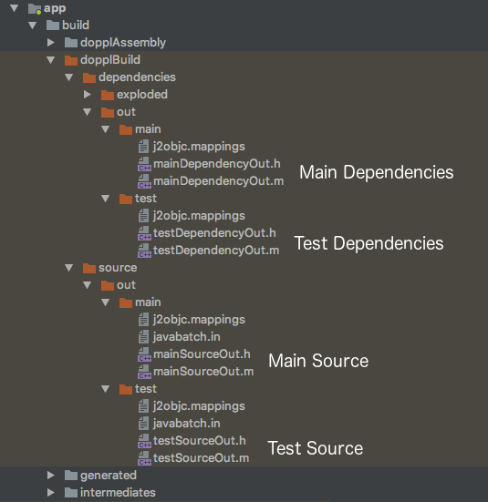

# Doppl Gradle Plugin

This the Doppl framework Gradle plugin. Doppl is a build and dependency system intended to facilitate Android and iOS
code sharing using J2ojbc.

You can read below for more plugin detail, but its highly recommended that you check out the higher level docs and quickstart first.

[What is Doppl?](http://doppl.co/overview.html)

[Quick Start](http://doppl.co/docs/quicktutorial.html)

## Tasks

This is the task dependency tree. The referenced constants can be found in DopplPlugin.groovy. For most users, the important 
ones to note are:

* TASK_DOPPL_BUILD - 'dopplBuild' This will stage and translate dependencies and source for both main and test paths,
and create the cocoapods podspec files to be used in Xcode. It's probably the only task you'll ever reference directly.

* TASK_DOPPL_ARCHIVE - 'dopplArchive' This creates the dependency structure for distributing libraries. You'll only need
this if you're creating a library.

* TASK_J2OBJC_PRE_BUILD - 'j2objcPreBuild' If you need to run something before EVERYTHING in doppl runs, make this task depend on your task.

* TASK_DOPPL_CONTEXT_BUILD - 'dopplContextBuild' Similar to above, but run after all the project's java operations run, 
including annotation processing.


## Dependencies

One of the core features of the Doppl plugin is dependency management. The basic concept is to have compatible dependencies that will allow you to share 
code to Objective-C. J2objc is fairly implementation agnostic, Doppl is focused around sharing code and architecture between Android and iOS.

### Archive Type

There are basically 2 archive types available: the 'dop' type and a standard Java sources jar.

#### Dop Archive

The dop archive is a regular zip archive with the '.dop' extension. The purpose of the special archive type are somewhat historical, but there are still a few important reasons 
to have a custom archive type. 

1. You can include C/C++/ObjC/Swift code directly in your dependency
2. There is no confusion that this Java source is intended for J2objc. Most open source Java project deploy a sources jar, but they would be unlikely to transpile out of the box.
3. Sources jars are generally co-published with regular jars, and maven doesn't do a good job of transitive dependencies with classifiers.

Inside the archive, the Java sources are in a 'java' folder. Native code is in the 'src' folder, although most dependencies won't have native code included.

Here's an exmaple dependency declaration for rxjava2 and rxandroid2

```gradle
implementation "io.reactivex.rxjava2:rxjava:2.1.5"
doppl "co.doppl.io.reactivex.rxjava2:rxjava:2.1.5.3"
implementation "io.reactivex.rxjava2:rxandroid:2.0.1"
doppl "co.doppl.io.reactivex.rxjava2:rxandroid:2.0.1.7"

```

#### Sources Jar

You can simply reference source jars for some projects, but in general its better to fork these projects to create your own Doppl dependencies. It's good practice 
to run the unit tests in translated Objective-C, and many projects will have their own dependency hierarchy that you'll need to fill. For Android related dependencies
you'll often need to remove UI related code.

Summary, most source jars aren't going to work well out of the box, but you can reference them.

```gradle
implementation "io.reactivex.rxjava2:rxjava:2.1.5"
doppl "io.reactivex.rxjava2:rxjava:2.1.5:sources"
implementation "io.reactivex.rxjava2:rxandroid:2.0.1"
doppl "io.reactivex.rxjava2:rxandroid:2.0.1:sources"

```

The rxjava2 dependency will probably transpile, but you'll have some memory issues. The rxandroid dependency will probably not transpile on its own.

### Configurations

There are 3 configurations for Doppl dependencies

* doppl: Main source compile configuration. Will be included in downstream dependencies.
* dopplOnly: Main source compile configuration. Will *not* be included in downstream dependencies.
* testDoppl: Test source compile configuration.

They're roughly equivalent to compile, provided, and testCompile. In newer builds, implementation, compileOnly, and testImplementation.

```gradle
implementation "com.google.code.gson:gson:2.6.2"
doppl "co.doppl.com.google.code.gson:gson:2.6.2.7"
compileOnly project(":paging:common")
dopplOnly project(":paging:common")
testImplementation "junit:junit:4.12"
testDoppl "co.doppl.junit:junit:4.12.0"

```

### Project Dependencies

Project dependencies generally work, but there have been some issues in certain configurations. Also, the maven publishing plugin cannot deploy more than one artifact,
which can cause issues with the project dependencies if you're building a library. This is an open issue and will hopefully be resolved.

### Our dependency conventions

Most forked dependencies that we publish have 2 distinct differences in their publishing info. We prefix the package with 'co.doppl' and add an extra number suffix to the 
version. The prefix is to make it absolutely clear that this library isn't managed by the original author. The suffix is 
to version and publish J2objc-related changes while still tracking the original Java version.

### What about annotation processing?

Annotation processing generally generates more Java and puts that in the 'generated' subfolder of build. Assuming 
things are configured correctly, the Doppl plugin should find that and send it through J2objc just like your source. So,
usually, you don't need to do anything! 

## Plugin Design

The plugin collects your dependencies, then attempts to transpile your code and dependencies to Objective C output. The plugin will also generate cocoapod
definition files which make integrating the transpiled code simpler. Using Cocoapods is optional but suggested.

In the past, each input Java file would generate both an 'h' and an 'm' file on output. For a number of reasons, the way the Doppl plugin runs j2objc is different. 
For all main Java input files, there is one large 'h' and 'm' output. Same for all dependencies, all test Java files, and all test dependencies. If you have 
both main and test Java and some set of depdendencies for each, that means 4 sets of 'h' and 'm' files total.



There are reasons for outputing fewer, larger files, and pros and cons. If you edit some of your Java, you won't get incremental builds. The plugin will output new Objective-C, 
Xcode will recompile. Also, especially for dependencies, the Objective-C file can become quite large. On the plus side, Xcode seems to be able to build fewer larger files
much faster than many smaller ones.

The original purpose for the change was that J2objc out of the box uses folders for packages, like Java does, but Xcode doesn't really deal well with folders. If two files
have the same name, even if they're in different folders, Xcode will simply compile both but only link to one. It doesn't work, basically. We had a solution that output 
long filenames instead, but single files is much simpler internally. We *may* add individual files in the future. However, 
one of the near term goals is to get rid of our custom J2objc fork. This output method is far less custom, although we'll
still need to get a pull request accepted upstream.

## Config

Options that can be set in dopplConfig. Except where noted, the example value in the default, and
can be left empty in your config (if you're happy with the default).

```groovy
dopplConfig {

    //Adds metadata to generated code that will let you debug in Java instead of Objective-C
    javaDebug false
    
    //Adds metadata to generated code that will let you debug in Java instead of Objective-C
    //This applies to dependency code
    dependenciesJavaDebug false
    
    //Prefix applied to classes with matching package. Shortens Objective-C name.
    //All packages must be explicitly added. No wildcards.
    // *There are no default prefixes defined*
    translatedPathPrefix 'com.example.foo', 'FOO' 
    translatedPathPrefix 'com.example.bar', 'BAR'
    
    //By default, all Java code in your module is translated. However, in some cases this won't make
    //sense. Especially if in an Android module. Use a pattern to match which files you want 
    //to translate
    translatePattern {
        include '**/shared/**'
        include '**/BuildConfig.*'
    }
    
    //Applies to 'dopplTest' task, which creates a list of tests to run based on path
    //By default, the pattern is 'include "**/*Test.java"', but can be customized.
    testIdentifier {
        include "**/*Test.java"
        exclude "**/OneTest.java" //A file matches that we don't want
        exclude "**/Abstract**.java" //If we prefix your abstract classes with 'Abstract', exclude them
    }
    
    //The cocoapod framework definitions have some specific config options available. All have 
    //default values, so this is generally not necessary, but available
    mainFramework{
    
        //Point to Xcode project with the Podfile defined. This will automatically call
        //'pod install' when needed based on added/removed classes and dependencies.
        managePod "../ios"
    
        /************ XCODE STUFF ************/
        /************ These are all build settings with sane deftauls ************/
        
        //Xcode linker flags. If you're new to Xcode, best to skip these.
        //Adds -ObjC flag to linker
        flagObjc = true
        
        //Library linker flags
        libZ = true
        libSqlite3 = true
        libIconv = true
        libJavax_inject = true
        libJre_emul = true
        libJsr305 = true
        libGuava = test //Only applied to test podspec
        libMockito = false //Deprecated. Use doppl library instead of J2objc built in
        libJunit = false //Deprecated. Use doppl library instead of J2objc built in
        
        //More library linker flags
        addLibraries "somelib", "another"
        
        //Links to UIKit framework. Often required for J2objc builds
        frameworkUIKit = true
        
        //More frameworks
        addFrameworks "SomeOtherFramework"
    
        //Writes local path to podspec. If false sets $(J2OBJC_LOCAL_PATH), which you need to set
        //in Xcode env variables
        writeActualJ2objcPath = true
    
        /************ OTHER SETTINGS ************/
    
        //The following values are required by Cocoapods to define a podspec. Assuming you won't be 
        //publishing your generated podspec, changing these values won't accomplish anything, but
        //they are configurable
        homepage = "http://doppl.co/"
        license = "{ :type => 'Apache 2.0' }"
        authors = "{ 'Filler Person' => 'filler@example.com' }"
        source = "{ :git => 'https://github.com/doppllib/doppl-gradle.git'}"
    }
    
    testFramework{
        //Same as above, for the test cocoapod
    }
    
    //Android only. By default the plugin uses the debug variant to look for generated sources.
    //If you want a different or custom variant, specify here.
    targetVariant = "debug"
    
    //Skips some test tasks to speed up translation. This is false by default, and in general should
    //only be used during development.
    skipTests = false
    
    //The plugin runs upstream Java build tasks to make sure any generated code is available. This 
    //can add significant time to the edit/test cycle during development. You can disable this 
    //temporarily to speed the process up, but leaving this on will be obviously problematic. 
    skipDependsTasks = false
    
    //The plugin should be able to automatically find generated source directories, but you can specify
    //a path if this automatic discovery isn't working
    generatedSourceDirs "build/generated/source/apt/debug", ...
    
    //Same for test code
    generatedTestSourceDirs "build/generated/source/apt/test/debug", ...
    
    //Arguments sent to J2objc translator. See J2objc docs for info.
    translateArgs "-foo", "-bar"
    
    //Arguments sent to J2objc cycle finder. See J2objc docs for info.
    cycleFinderArgs "-foo", "-bar"
    
    //If you want to disable our analytics code. We capture info from the plugin. All
    //data is anonymous. We don't know anyting about you or your app, just what settings
    //and versions you're using. We may in the future add performance values and failures
    //to captured data.
    disableAnalytics = false
}
```

## License

This library is distributed under the Apache 2.0 license found in the [LICENSE](./LICENSE) file.
J2ObjC and libraries distributed with J2ObjC are under their own licenses.

## History

The Doppl plugin started as a fork of the earlier [j2objc-gradle](https://github.com/j2objc-contrib/j2objc-gradle) plugin. Although ideologically similar, 
the two plugins differ significantly at this point in scope.

Many thanks to the [developers](https://github.com/doppllib/doppl-gradle/blob/master/NOTICE#L19) of j2objc-gradle.

### Main Contributors

* Advay Mengle @advayDev1 <source@madvay.com>
* Bruno Bowden @brunobowden <github@brunobowden.com>
* Michael Gorski @confile <mail@michaelgorski.de>

### Thanks

* Peter Niederweiser @pniederw <peter@pniederw.com>
* Sterling Greene @big-guy <sterling.greene@gradleware.com>

